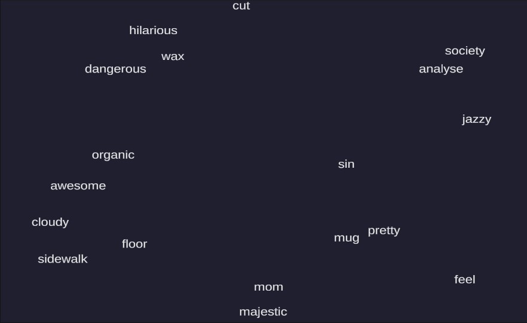

# falling-text-unity
My attempt to recreate the text falling game featured in the "Typing Game" live stream by Brackeys.

Link to Live Stream: https://www.youtube.com/watch?v=HvMrOoUeqO0&ab_channel=Brackeys

## 
The project implements the features shown in the livestream. The hope is that in the future I can develop this project more and include more features, such as:
- Effects upon word reaching bottom of screen. Currently, there is no collision once a word reaches the bottom and nothing happens when they do. Maybe we can include a penatly or game over.
- Keep track of the number of words typed. 
- Update Graphics.

Project was built using Unity version `2019.4.12f1`
